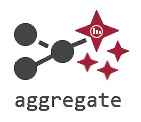
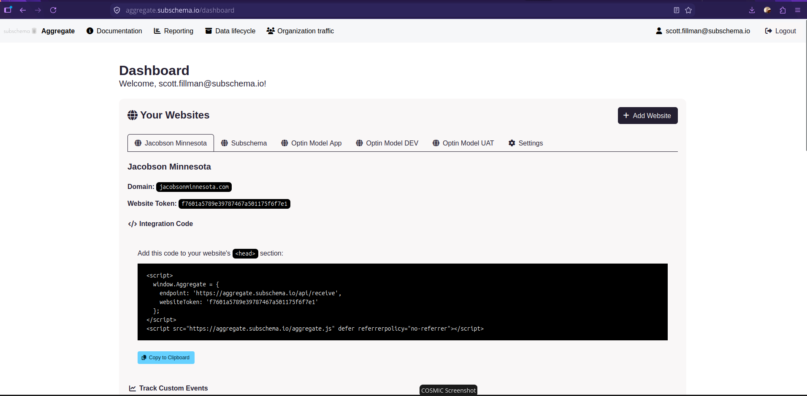

# Headless Privacy Analytics

Measure events without assigning every visitor an identity.

Self-hosted web analytics with privacy-minimized anonymous-mode events, optional consent-based enhanced analytics, and reporting views for Power BI, Tableau, and other BI tools.

[](LICENSE)
[](js/LICENSE.txt)
[](https://php.net)
[](https://github.com/Subschema-LLC/aggregate/actions/workflows/ci.yml)

**Beta software: contributors and early adopters are welcome.** Start with a
disposable installation and synthetic events. Help test installation, consent,
headless administration, and database reporting through the
[beta testing guide](docs/BETA-TESTING.md). Review its known limitations before
using the platform with live traffic; no independent security or privacy audit
is claimed.



Aggregate's anonymous mode creates no visitor identifier. By default, an anonymous event holds a sanitized path, a coarse referrer channel, device and viewport buckets, and a UTC hour. It stores no visitor or session ID, IP address, User-Agent string, or exact event timestamp. Optional goals, coarse geography, organization markers, and explicitly allowlisted properties can add context; their values still need review for identifying detail.

Useful insight does not require a visit or session ID. Broad medium values, when
explicitly allowed, can complement channels, page-path activity, event tracking
and goal counts to help paint a picture of what is working. See the
[measurement guide](docs/PRIVACY-COMPLIANCE.md#insight-without-visit-or-session-ids)
for examples and current reporting boundaries, and the [roadmap](ROADMAP.md#proposals-to-explore)
for planned work.

When you need more, enhanced mode adds identifiers, properties and exact dimensions — but only for visitors who have made an affirmative choice, and it stops the moment they withdraw it.

Once you start collecting data, connect Power BI, Tableau, or Looker to the approved aggregate reporting views.



## What you get

**Privacy-minimized event collection.** Page views and named events, stored with sanitized
paths, coarse dimensions and hour buckets. Emails, UUIDs and numeric route IDs are stripped
out of paths before storage. Optional allowlisted conversion goals and continent- or
country-level geography. Keep raw events private and use the thresholded reporting views
for routine BI access.

**Suppression in the view, not the dashboard.** `bi_anonymous_events_v1` and its siblings
withhold the current bucket and hide any cell below your configured minimum. The threshold
lives in the database and applies to every consumer of these views. Keep raw input
tables private when granting a BI connection access.

**Consent that actually toggles something.** `setConsent(true)` turns on visitor and session
IDs, custom properties and exact dimensions. `setConsent(false)` drops the identifiers and
returns to coarse rows. Wire it to your CMP and the behavior matches what the banner
promised.

**Optional administration UI.** Operate collection, setup, and maintenance through
YAML and CLI commands; set `DASHBOARD_ENABLED=0` to disable dashboard/login routes.
BI disclosure thresholds currently require the admin UI or controlled database
administration; see [configuration sources](docs/CONFIGURATION.md). Visualize
analytics in your BI tool; the application UI manages the installation and its data contracts.

**Rebrandable without a fork.** Name, logo, colors and fonts are configuration. Contrast
ratios are validated, so an unreadable palette gets rejected rather than shipped.

**Portable infrastructure.** PHP 8.2+ on PostgreSQL, MySQL, MariaDB, SQL Server or
SQLite, with native and Docker deployment options. Size the host for your traffic,
retention policy, and database; beta reports should include the workload tested.

**A way to exclude your own team.** Mark staff browsers with a configurable cookie or local
storage flag and filter them out in your BI tool, without dropping the data or trusting an
IP range.

Details:

- **Privacy-minimized collection:** page views and safe named events, with optional allowlisted goals and coarse local geography.
- **Reporting views with suppression:** completed hourly or daily aggregates with configurable minimum event counts.
- **Optional page depth:** a capped page count shared by events on each page, with tab storage or URL parameter passing configured through UI/YAML. See [storage, URL and reporting boundaries](docs/DATA-MODEL.md#optional-page-depth) before enabling it.
- **Consent-based enhanced detail:** visitor/session IDs, properties, and exact dimensions when enabled by your consent manager.
- **Headless operation:** an ingestion API, YAML configuration, and CLI commands, with an optional admin dashboard.
- **Organization traffic markers:** mark team browsers with a configurable cookie or local storage entry, defaulting to `orgInternalTraffic=true`, and filter retained event JSON in BI reports.
- **Configurable branding and lifecycle:** dashboard name, logo, colors, fonts, archiving, and retention policies.
- **Database choice:** PostgreSQL, MySQL, MariaDB, SQL Server, or SQLite. Enhanced ingestion uses Symfony Messenger with synchronous or asynchronous delivery.

## What you give up

This matters more than the feature list, so it's up front.

**No unique visitors, sessions or bounce rate in anonymous mode.** Not because they haven't
been built yet, but because computing them requires exactly the identifier this project
refuses to create. Anonymous mode counts events. One person can contribute several of them
to the same cell.

**Small numbers disappear.** A cell below your threshold is withheld, and widening the time
window in your BI tool won't recover it. Low-traffic sites can have persistent gaps;
combining periods only combines cells already released by the views.

**Reports lag one bucket.** The current UTC hour is never released for events; the current
UTC day is never released for goals and geography. There is no real-time view.

**"Anonymous" is the name of a mode, not a legal conclusion.** Rare paths, unusual event
names, small populations and outside information can still make a row personal in context.
Withdrawing consent is prospective — it stops future enhanced detail, it does not erase
what the server already holds. The
[compliance guide](docs/PRIVACY-COMPLIANCE.md) is specific about where the line sits and
what remains your responsibility.

This project suits teams that want self-hosted event measurement feeding their existing BI tools. It does not provide session replay, heatmaps, or a built-in marketing attribution suite.

## Is this for you?

**Likely yes** if you answer to a privacy office or DPO, you run a public-sector, health,
education or legal site, you already own a BI stack and want measurement to feed it rather
than compete with it, or you want to be able to explain your whole data model on one page.

**Likely no** if you need unique-visitor counts, funnels, session replay, heatmaps or
marketing attribution. [Plausible](https://plausible.io) and [Matomo](https://matomo.org)
are good software and will serve you better. This isn't trying to win that comparison.

## Quick start

### On a web host, from a release ZIP

No terminal is needed:

1. Download `aggregate-VERSION.zip` from the **Assets** of the
   [latest release](https://github.com/Subschema-LLC/aggregate/releases/latest)
   (not the **Source code** archives).
2. Upload and extract it with your hosting panel's file manager, and set the
   site's document root to the extracted `public` folder.
3. Open the site. The setup page checks the server, asks for the one-time code
   in `SETUP-CODE.txt`, tests your database connection and writes `.env.local`.
   Then create the administrator account.

See [Release ZIP on a web host](DEPLOYMENT.md#release-zip-on-a-web-host) for the
details and step-by-step hosting panel guides (Plesk so far). PHP 8.2+ and MySQL
8.0+, MariaDB 10.6+, PostgreSQL 13+, SQL Server 2017+ or SQLite are required.

### For development

For this development setup, install PHP 8.2+, Composer, the required PHP extensions and database driver, Docker Compose, and Make. The [deployment guide](DEPLOYMENT.md) covers native and production installation; [CONTRIBUTING.md](CONTRIBUTING.md#set-up-a-development-checkout) covers development prerequisites in detail.

From a fresh checkout:

```bash
git clone --branch development https://github.com/Subschema-LLC/aggregate.git
cd aggregate
cp .env.dev .env
cp config/aggregate.yaml.example config/aggregate.yaml
composer install
make start-mysql
make migrate-mysql
```

The checked-in Compose setup serves **http://localhost:9001**. Set the active YAML environment's `app_host` to that URL for local integration snippets. Open `/install` to create a dashboard administrator, then register a website in the dashboard or through the CLI:

```bash
docker compose exec php php bin/console app:create-website
curl http://localhost:9001/api/health
```

Use `start-postgres` / `migrate-postgres` or `start-mariadb` / `migrate-mariadb` for another Docker profile. The sample environment is for development; use your own secrets and connection settings in production. Existing installations should follow the [upgrade guidance](docs/PRIVACY-COMPLIANCE.md#upgrading-older-installations) before applying historical privacy migrations.

Admins choose an update method on the **Updates** page: signed **release ZIPs** (recommended) or **the repository** for Git clones (advanced). Install updates with the **Install update** button or `php bin/console app:updates:apply`; migrations and cache rebuilds run with a maintenance page in place. `updates_method` and `updates_branch` (default `master`) can also be set in YAML or with `app:updates:method`. Your `.env.local`, `config/aggregate.yaml`, website and tag settings, `config/*.local.yaml` overrides and `var/` data are never overwritten. See the [update guide](docs/UPDATES.md) and [signed release packages](docs/RELEASES.md).

The **Feature flags** admin page and YAML can disable Updates or hide its
navigation entries. Updates stays enabled by default. See the
[feature flag guide](docs/FEATURE-FLAGS.md) for configuration and contributor examples.

## Add tracking to a website

**Websites** and the [Setup wizard](docs/SETUP.md) generate window configuration,
query-parameter, or tag-manager installation snippets. For a direct tracker
installation, use the website token from your registration and your analytics host:

```html
<script>
  window.Aggregate = {
    endpoint: 'https://analytics.example.com/api/receive',
    websiteToken: 'your-website-token',
    consent: false
  };
</script>
<script src="https://analytics.example.com/aggregate.js?min=1" defer referrerpolicy="no-referrer"></script>
```

The tracker sends a page view automatically. Once it has loaded, record a named event with `window.Aggregate.emit('button_click')`. Configure goals and review event properties before using them.

Tag-manager snippets install the container and enabled CMP. To load analytics
through it, explicitly enable the manager and add the supplied tracker URL as a
[script action](docs/TAG-MANAGER.md#load-the-tracker-through-the-manager). Remove
any separate tracker installation to avoid duplicate page views.

Connect your consent manager to `window.Aggregate.setConsent(true)` only after an affirmative choice, and call `setConsent(false)` for rejection or withdrawal. The [tracking and GTM guide](docs/TRACKING.md) covers custom events, tag setup, consent wiring, and troubleshooting.

A dedicated [Aggregate Google Tag Manager tag template](https://github.com/Subschema-LLC/aggregate-gtm-tag-template)
is under development in a separate repository. Follow that repository for template
progress and availability. The tracking guide includes GTM Custom HTML examples.

## Configuration and reporting

| Setting | Source of truth |
| --- | --- |
| Database, transport, app secret, proxy trust | Symfony environment files or server environment variables |
| Branding, collection controls, organization markers, lifecycle, dashboard toggle | `config/aggregate.yaml` and supported environment overrides |
| Custom property model, UTM/query mappings, consent requirements, reporting columns | `config/aggregate.yaml`, managed through the Data model admin page or YAML |
| Website domains, [allowed event sources](docs/CONFIGURATION.md#website-domains), and public ingestion tokens | `config/websites.yaml`, managed through the dashboard, YAML, or CLI creation options |
| Per-website CMP, tags, triggers, and variables | `config/tag-manager/sites/<site-id>.yaml`, managed through the Tag manager admin page or YAML |
| Conversion-goal definitions | `config/goals.yaml`, customized in `config/goals.local.yaml` |
| Navigation labels and links | `config/navigation.yaml`, customized in `config/navigation.local.yaml` |
| BI disclosure thresholds | `analytics_privacy_settings` in the database; dashboard or controlled database administration |

For headless deployments, set `dashboard_enabled: false` in the active YAML environment and `DASHBOARD_ENABLED=0`, then clear Symfony's cache. BI thresholds remain database settings; they are not mirrored in YAML. The [configuration reference](docs/CONFIGURATION.md) explains defaults, overrides, branding, goals, organization markers, and retention.

Routine BI connections should use approved views:

| View | Reports |
| --- | --- |
| `bi_anonymous_events_v1` | Hourly page views and named events |
| `bi_anonymous_goals_v1` | Daily occurrences of configured goals |
| `bi_anonymous_geo_events_v1` | Daily coarse geography with additional suppression |

Keep raw `events`, archive tables, and unsuppressed operational views private. Organization markers are stored under their configured name in raw event JSON; the grouped views and archives omit that flag. See the [compliance guide](docs/PRIVACY-COMPLIANCE.md#bi-exposure-and-suppression) for access and disclosure rules, [organization traffic](docs/PRIVACY-COMPLIANCE.md#organization-traffic) for filtering, and the [database guide](docs/DATABASE.md) for connections and schema details.

The [Data model](docs/DATA-MODEL.md) page provides UTM/query mappings, configurable anonymous property whitelists, downloadable YAML, and UI/CLI regeneration of private custom reporting views. All UTMs require consent by default. Anonymous attribution should use at most a broad `utm_medium`; administrators can override this recommendation with the documented warning about more detailed values.

Generate and copy [synthetic event examples](docs/EVENT-EXAMPLES.md) from the
saved model, or export them with `php bin/console app:analytics:examples`.
Optional value types and separate numeric reporting columns support external
calculations without changing existing text columns. The ecommerce recipe uses
flat properties and integer minor units for money. Administration pages and
[configurable submenus](docs/CONFIGURATION.md#main-navigation) keep each task focused.

Use the optional [JavaScript build](docs/JS-BUILD.md) for minified tracker and drop-in scripts.
The [Setup wizard](docs/SETUP.md) provides installation steps, button callouts,
and per-website CMP/script copy or download. The optional [simple tag manager](docs/TAG-MANAGER.md)
stores each site's settings in YAML, serves its scripts remotely from the Aggregate
installation, and maps each tag to a consent category or an explicit option to
run without consent.
Tags can load scripts or call an existing library method, triggered by page
readiness, browser events, or data-layer events with named variable references.

## Documentation

All guides are also published as a searchable site that needs no account:
**[subschema-llc.github.io/aggregate](https://subschema-llc.github.io/aggregate/)**.
It is built from these files on `master` and describes the current release.

| Guide | Contents |
| --- | --- |
| [Why Aggregate exists](docs/WHY.md) | The problem, the principles, and what the project deliberately will not do |
| [Architecture tour](docs/ARCHITECTURE.md) | How an event flows from a web page to a BI report, and where to make common changes |
| [Design decisions](docs/DESIGN-DECISIONS.md) | Why the main choices were made, what they cost, and what would change them |
| [Glossary](docs/GLOSSARY.md) | Terms used across the code, settings and documentation |
| [Contributing](CONTRIBUTING.md) | Branching strategy, development setup, architecture, privacy invariants, tests, Make commands, and pull requests |
| [Beta testing](docs/BETA-TESTING.md) | First test session, expected privacy/reporting behavior, known limitations, and feedback |
| [Agent guide](AGENTS.md) | Product ethos, architecture boundaries, privacy rules, and development expectations for coding agents |
| [Roadmap](ROADMAP.md) | Planned work, available foundations, and current update limitations |
| [Security policy](SECURITY.md) | Private vulnerability reporting and disclosure guidance |
| [Code of conduct](CODE_OF_CONDUCT.md) | Community expectations and reporting concerns |
| [Public release preparation](docs/PUBLIC-RELEASE.md) | Maintainer reporting setup, Git history review, GitHub checks, and launch steps |
| [Privacy and compliance](docs/PRIVACY-COMPLIANCE.md) | Measurement limits, consent, organization traffic, BI suppression, logging, retention, and operator checks |
| [Configuration](docs/CONFIGURATION.md) | YAML settings, environment overrides, branding, goals, and lifecycle policy |
| [Feature flags](docs/FEATURE-FLAGS.md) | YAML/admin controls, navigation visibility, and developer/contributor guidance |
| [Data model](docs/DATA-MODEL.md) | UTM/query mappings, anonymous property whitelists, model sharing, and custom reporting columns |
| [Event examples](docs/EVENT-EXAMPLES.md) | UI copy/download, headless JSON exports, typed properties, and a flat ecommerce recipe |
| [JavaScript build](docs/JS-BUILD.md) | Optional minification, dynamic tracker configuration, and build verification |
| [Updating](docs/UPDATES.md) | Choosing release ZIP or repository updates, setting up a Git clone, switching methods, recovery and troubleshooting |
| [Release packages](docs/RELEASES.md) | Publishing from master, signing keys, installable ZIPs, verification, and update groundwork |
| [Tracking and GTM](docs/TRACKING.md) | Browser integration, custom events, tag-manager examples, and troubleshooting |
| [GTM tag template](https://github.com/Subschema-LLC/aggregate-gtm-tag-template) | Separate repository for the Google Tag Manager tag template, under development |
| [Deployment](DEPLOYMENT.md) | Docker/native setup, web servers, workers, production operations, and upgrades |
| [Plesk deployment](PLESK-DEPLOYMENT.md) | Plesk steps for a release ZIP without SSH, Git-based setup, and worker options |
| [Database](docs/DATABASE.md) | Supported engines, connection strings, migrations, and reporting schema |

## Contributing

Create a working branch from the latest `development`, using a descriptive name
such as `feature/add-goal-validation`, `issue/123-fix-consent`, `docs/update-setup`,
or `chore/update-dependencies`. Changes move through pull requests in this order:

1. **Working branch → `development`:** contributors submit changes for review and integration.
2. **`development` → `uat`:** maintainers promote changes for user acceptance testing (UAT).
3. **`uat` → `master`:** maintainers promote accepted changes for production release.

Keep contributor PRs targeted at `development`; `uat` and `master` receive the
promotion PRs above. See the [branching strategy](CONTRIBUTING.md#branching-strategy)
for branch roles and PR targets, and the [release guide](docs/RELEASES.md#publish-a-release)
for tagging and publishing from `master`.

Contributions should preserve the privacy invariants and favor simple, portable,
secure, maintainable designs. Start with [CONTRIBUTING.md](CONTRIBUTING.md).

You can also contribute without writing application code: try a fresh install,
exercise your database engine, reproduce a reported bug with synthetic data,
review keyboard access and mobile administration, or improve a confusing setup
step. The [roadmap](ROADMAP.md#public-beta-priorities) lists the highest-priority
work; the [beta testing guide](docs/BETA-TESTING.md) explains what makes a useful
test report.

Contributions developed with AI coding agents are welcome. Bring your own expertise and judgment to the collaboration: provide project context, guide the agent's decisions, and review and test the result. Please submit changes you understand and can explain, including how they fit Aggregate's architecture and privacy goals. The contributor remains responsible for the work they submit.

Follow the [code of conduct](CODE_OF_CONDUCT.md), review the [roadmap](ROADMAP.md) before proposing substantial work, and use the [security policy](SECURITY.md) for private vulnerability reports.

## License

The license split is:

- **Browser tracker:** [public/aggregate.js](public/aggregate.js) is licensed under **BSD-3-Clause**, with the full text in its header and [js/LICENSE.txt](js/LICENSE.txt). This file is also the tracker source; there is no separate build source. The configured script served at `/aggregate.js` carries the same BSD license.
- **Code of Conduct:** [CODE_OF_CONDUCT.md](CODE_OF_CONDUCT.md) adapts Contributor Covenant 2.1 under **CC BY 4.0**, with source attribution and license links in that file.
- **Everything else in this project's first-party code and documentation:** **GNU AGPL version 3 only (AGPL-3.0-only)**, under [LICENSE](LICENSE). This includes the server, dashboard, and other JavaScript; the tracker exception does not change their license.

Third-party dependencies and vendored assets retain their own licenses, including the vendored [Bulma MIT notice](assets/styles/vendor/bulma/LICENSE).
