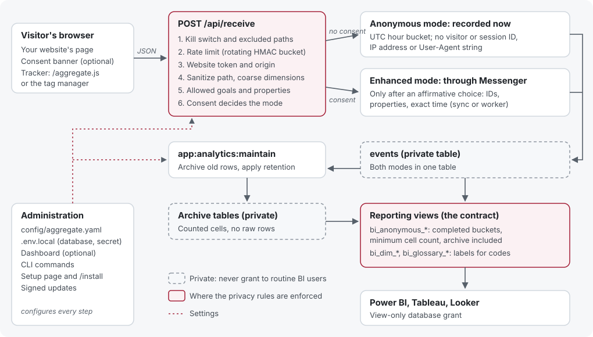

# Architecture tour

[Why Aggregate exists](WHY.md) · [Design decisions](DESIGN-DECISIONS.md) · [Glossary](GLOSSARY.md) · [File map](../CONTRIBUTING.md#architecture-and-file-map)

A walk through how Aggregate works, for people about to change it. It follows
one event from a web page to a BI report, then covers configuration,
administration, browser scripts and tests. The
[file map in CONTRIBUTING.md](../CONTRIBUTING.md#architecture-and-file-map)
lists where things live; this page explains how they fit together.

*Select the diagram to open it at full size.*

Aggregate is a Symfony application with Doctrine for database access. It has
two halves that share one database: **collection**, which is public and
protected by privacy rules, and **reporting**, which is SQL views that BI tools
read. The dashboard is an optional third part for administration.

## The life of an event

### 1. The browser sends it

A website loads the tracker, [public/aggregate.js](../public/aggregate.js), from
the installation. [ScriptController](../src/Controller/ScriptController.php)
serves it with the deployment's public settings: namespace, collection profile,
allowed properties and the organization-traffic marker. The tracker is
hand-written source with no build step; an optional minified copy is built with
Terser (see [JavaScript build](JS-BUILD.md)). A consent manager, either the
built-in one or the site's own, tells the tracker whether the visitor opted in.

The tracker posts a small JSON payload to `/api/receive`: page path, event name,
coarse dimensions, and, only with consent, identifiers and properties.

### 2. The server checks it

[ReceiveController](../src/Controller/ReceiveController.php) applies the rules in
this order, and stops at the first one that fails:

1. **Kill switch and excluded paths.** If collection is off
   (`anonymous_tracking_enabled`) or the sanitized path matches an excluded
   route, the event is ignored. This happens before anything else is derived
   from the request.
2. **Rate limit.** [IpRateLimiter](../src/Security/IpRateLimiter.php) counts
   requests per client in one-minute windows. Each window's bucket name is an
   HMAC of the window and the address, so the file on disk cannot link the
   address across windows and the address is never stored.
3. **Website token and origin.** The public token must belong to a registered
   website ([WebsiteConfigManager](../src/Service/WebsiteConfigManager.php)), and
   the `Origin` (or `Referer`) must pass that website's domain rules
   ([WebsiteDomainPolicy](../src/Service/WebsiteDomainPolicy.php)).
4. **Sanitize.** [PrivacySanitizer](../src/Service/PrivacySanitizer.php) reduces
   the path (query strings, fragments, and identifiers such as emails, UUIDs and
   numeric IDs are removed), and turns the referrer, device and screen width into
   coarse buckets. The **strict** collection profile
   ([CollectionProfile](../src/Service/CollectionProfile.php)) keeps only the
   path, the event name and allowed goal codes, and ignores everything else,
   including consent.
5. **Goals and properties.** [GoalEventRegistry](../src/Service/GoalEventRegistry.php)
   accepts only configured goal codes, and
   [CustomDataSettings](../src/Service/CustomDataSettings.php) keeps only
   properties the data model allows. Anonymous events accept only those
   explicitly allowed without consent.
6. **Consent decides the mode.** [PrivacyPolicy](../src/Service/PrivacyPolicy.php)
   treats only an affirmative choice as consent; a string such as `"false"` is
   not consent.

Optional geography is looked up in a local MMDB file (`src/Service/GeoIp`) and
reduced to a country or continent code. Collection makes no network calls.

### 3. It is recorded

- **Anonymous mode** (no consent):
  [AnonymousEventRecorder](../src/Service/AnonymousEventRecorder.php) writes the
  row immediately, with the time truncated to the UTC hour and no identifiers.
  Nothing more detailed than the stored row is ever written, not even briefly in
  a queue table.
- **Enhanced mode** (consent): the controller dispatches a
  [TrackEventMessage](../src/Message/TrackEventMessage.php) through Symfony
  Messenger, and [TrackEventHandler](../src/MessageHandler/TrackEventHandler.php)
  stores it with visitor and session IDs, properties and the exact time.
  Messenger delivers synchronously by default (`sync://`); larger sites can
  switch to a queue and a background worker.

Both modes write to the same `events` table ([Event](../src/Entity/Event.php)),
told apart by its `privacy_mode` column. The table is private: routine BI users
never get access to it.

### 4. Maintenance archives and deletes it

`app:analytics:maintain`
([AnalyticsMaintenanceRunner](../src/Service/AnalyticsMaintenanceRunner.php)),
run on a schedule when archiving or retention is turned on:

- **Archives** old rows into counted cells in private archive tables
  ([AnalyticsArchiveService](../src/Service/AnalyticsArchiveService.php)). The raw
  rows are then marked as archived so they are not counted twice.
- **Deletes** raw rows and archive cells older than the retention periods
  ([AnalyticsRetentionService](../src/Service/AnalyticsRetentionService.php)).
  Enhanced rows have their own, usually shorter, period.
- Holds a database **lease** ([AnalyticsMaintenanceLease](../src/Service/AnalyticsMaintenanceLease.php))
  so two runs never overlap.

Both are off by default; see [archiving and retention](CONFIGURATION.md#archiving-and-retention).

### 5. Reporting views publish it

Migrations in [migrations/](../migrations) create the reporting views. The
`bi_anonymous_*` views combine live and archived anonymous counts, release only
completed hours or days, and hide any cell below the minimum count stored in
`analytics_privacy_settings`
([AnalyticsPrivacySettings](../src/Service/AnalyticsPrivacySettings.php)). The
geography view also pools small areas into "other" so that a hidden area can't
easily be worked out by subtraction.

Around them:

- `bi_dim_*` and `bi_glossary_*` views give BI tools labels for codes, published
  from declared configuration by
  [GlossarySync](../src/Service/Glossary/GlossarySync.php) (see
  [BI labels and glossary](BI-GLOSSARY.md)).
- `analytics_custom_*` views project custom properties into columns. They are
  private, regenerated from the data model by
  [ReportingViewManager](../src/Service/ReportingViewManager.php).

A BI tool connects with a database user that can read only the approved views
(see [view-only grants](BI-GLOSSARY.md#view-only-grants)). Every column is listed
in [Connect a BI tool](BI-CONNECTION.md), and the suppression rules in the
[privacy guide](PRIVACY-COMPLIANCE.md#bi-exposure-and-suppression).

## Configuration

Settings have one source of truth each (listed in
[configuration sources](CONFIGURATION.md)):

- **`.env.local` or server variables:** infrastructure, such as the database,
  the application secret and the message transport.
- **`config/aggregate.yaml`:** application settings, read by
  [AggregateConfigLoader](../src/Service/AggregateConfigLoader.php). Many can be
  overridden by an uppercase environment variable of the same name.
- **`config/websites.yaml` and `config/tag-manager/sites/`:** registered websites
  and each site's consent banner and tags.
- **Shipped defaults** (`goals.yaml`, `navigation.yaml`, `quick_search.yaml`),
  customized through untracked `*.local.yaml` overrides.
- **The database:** BI thresholds only, an existing exception to the rule that
  every setting also exists in YAML.

When privacy configuration is invalid, the services fail closed: collection stops
rather than guessing. The dashboard and command line write through the same
services, so a setting has one validation wherever it is changed.

## Administration

- **Dashboard:** optional. `DASHBOARD_ENABLED=0` removes the login and every
  dashboard route ([Kernel](../src/Kernel.php) loads `routes_dashboard.yaml` only
  when it is on). Pages follow the [UI template conventions](../templates/README.md):
  Twig, Bulma, Stimulus and Turbo through AssetMapper, with no Node build.
- **Command line:** everything an administrator needs without the dashboard,
  in [src/Command](../src/Command). Examples: `app:install`,
  `app:create-website`, `app:user:reset-password`, `app:analytics:maintain`,
  `app:analytics:glossary:sync` and `app:updates:apply`.
- **First run:** a fresh release ZIP starts with a browser setup page,
  [config/setup.php](../config/setup.php) and
  [FirstRunSetup](../src/Setup/FirstRunSetup.php). It loads before Composer,
  checks the server, asks for the one-time code in `SETUP-CODE.txt`, tests the
  database and writes `.env.local`. [InstallController](../src/Controller/InstallController.php)
  then runs migrations and creates the administrator.
- **Updates:** `app:updates:apply` and the dashboard's **Install update** button
  install signed release ZIPs or fast-forward a Git clone. A maintenance page
  ([config/maintenance.php](../config/maintenance.php)) answers requests while
  files change, and backups allow rollback.
  [UpdatePaths](../src/Service/Update/UpdatePaths.php) lists the operator files
  an update never touches. See [updating](UPDATES.md) and
  [signed release packages](RELEASES.md).
- **Feature flags:** optional capabilities can be turned off for a whole
  deployment ([feature flags](FEATURE-FLAGS.md)).

## Browser scripts

Four scripts are served to websites, each with its own delivery path and
readable source:

| Script | Purpose |
| --- | --- |
| [public/aggregate.js](../public/aggregate.js) | The tracker (BSD-3-Clause) |
| [public/consent.js](../public/consent.js) | The built-in consent banner, configured per website |
| [public/tag-manager.js](../public/tag-manager.js) | The lightweight tag manager, loading tags by consent category |
| [micro-consent-dropins](../micro-consent-dropins/README.md) | The standalone consent banner, also usable without an installation |

Optional minified copies are generated with the pinned Terser; when they are
missing or stale, the readable source is served instead.

## Tests

| Suite | Covers | Runs with |
| --- | --- | --- |
| PHPUnit ([tests/](../tests)) | Services, controllers, commands and SQL generation, mostly with test doubles | `php bin/phpunit` |
| JavaScript ([tests/JavaScript](../tests/JavaScript)) | Tracker, consent and storage behavior in Node | `node --test tests/JavaScript/*.test.js` |
| Release tooling ([tests/Release](../tests/Release)) | Package building and signing | `python3 -m unittest discover -s tests/Release` |
| Fresh install ([tests/Integration/fresh-install.php](../tests/Integration/fresh-install.php)) | A full install, collection, archiving and every view on SQLite, MySQL, MariaDB, PostgreSQL and SQL Server | CI, or locally in a disposable copy |

Mocked SQL tests show what SQL is generated; only the fresh-install test shows
that an engine accepts it. See [tests and checks](../CONTRIBUTING.md#tests-and-checks).

## Where to make common changes

| You want to | Start here | Also update |
| --- | --- | --- |
| Add an operator setting | The service that owns the behavior, reading it through `AggregateConfigLoader` | The dashboard form (optional), `config/aggregate.yaml.example`, [CONFIGURATION.md](CONFIGURATION.md), and tests with the dashboard off |
| Collect a new dimension | Discuss it in an issue first; it changes the privacy model | `PrivacySanitizer`, `ReceiveController`, the strict profile, the views, and the [privacy guide](PRIVACY-COMPLIANCE.md) |
| Change what a reporting view returns | A new migration that adds a new versioned view (such as `_v2`), keeping the old one | SQL for all five engines, the fresh-install test, [DATABASE.md](DATABASE.md) |
| Write engine-specific SQL | A platform branch (`instanceof PostgreSQLPlatform` and so on), as in the existing migrations | The fresh-install CI run on every engine |
| Add a dashboard page | [templates/README.md](../templates/README.md) conventions and `config/navigation.yaml` | A command-line or YAML equivalent for any setting it changes |
| Add a documentation page | A Markdown file, then `website/pages.mjs` | Links from related pages, and a `DocumentationLinks` topic if the dashboard should link to it; see [documentation site](../CONTRIBUTING.md#documentation-site) |
